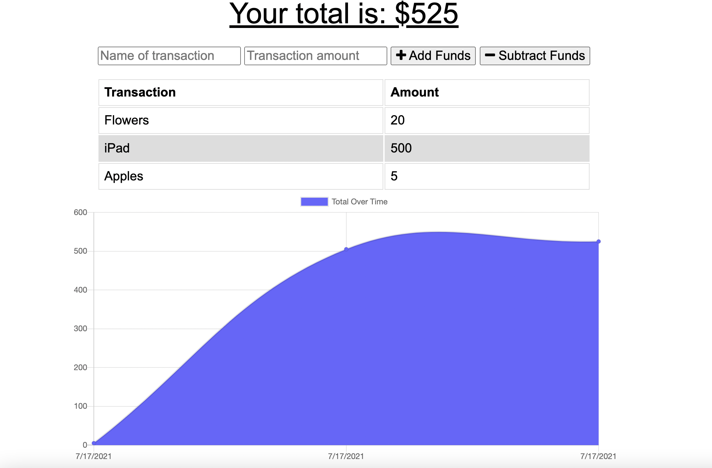
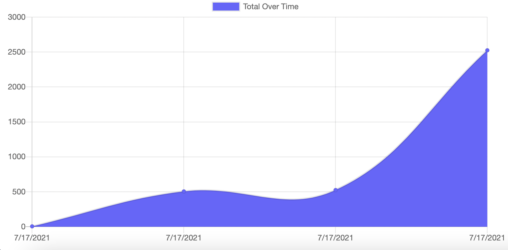
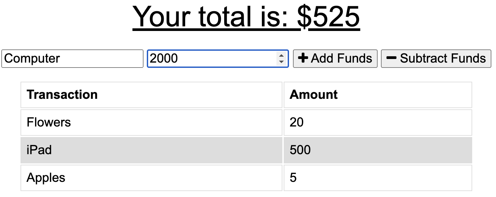

# budget-tracker-tool

# Description

This tool allows you to keep track of your finances.
By adding and removing purchases, this makes it easy to visualise your spending and plan for better financial decisions.
The program works offline so you are able to view and add to your monetary plannig even if you forget to pay the wifi bill.

# Table of Contents

- [Installation](#installation)
- [Useage](#useage)
- [Contributing](#contributing)
- [License](#license)
- [Questions](#questions)

# Installation

This site is deployed at https://budget-tracker-tool.herokuapp.com/

# Useage

The user can add each itme of purchase individually. This will appear on the graph to make it easy to visualise your spending habits.

# Contributing

Created by Madeleine O'Dea

# Tests

None

# License

Licensed under MIT. 
For more information, visit this link. 
https://opensource.org/licenses/MIT

# Questions

For more examples of my work, please visit my GitHub at [madsterest](https://github.com/madsterest)
or contact me at
odea.madeleine@gmail.com
